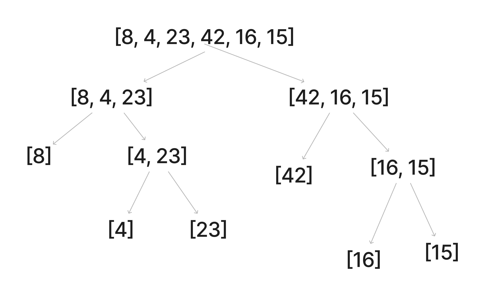
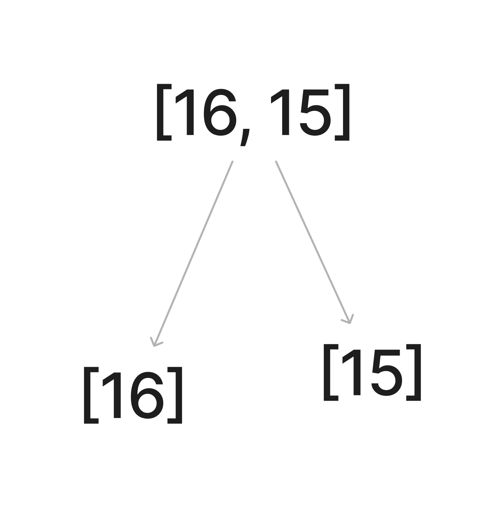
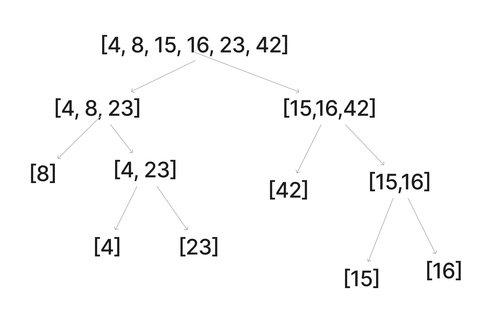

# Merge Sort

Merge Sort is a sorting algorithm that divides the input array in half recursively until there are single values.  From there you sort the two numbers, and merge them back together as each sub array merge occurs.

## Pseudocode

```pseudo
ALGORITHM Mergesort(arr)
    DECLARE n <-- arr.length

    if n > 1
      DECLARE mid <-- n/2
      DECLARE left <-- arr[0...mid]
      DECLARE right <-- arr[mid...n]
      // sort the left side
      Mergesort(left)
      // sort the right side
      Mergesort(right)
      // merge the sorted left and right sides together
      Merge(left, right, arr)

ALGORITHM Merge(left, right, arr)
    DECLARE i <-- 0
    DECLARE j <-- 0
    DECLARE k <-- 0

    while i < left.length && j < right.length
        if left[i] <= right[j]
            arr[k] <-- left[i]
            i <-- i + 1
        else
            arr[k] <-- right[j]
            j <-- j + 1

        k <-- k + 1

    if i = left.length
       set remaining entries in arr to remaining values in right
    else
       set remaining entries in arr to remaining values in left
```

## Trace

Sample Array: `[8,4,23,42,16,15]`

**Recursion**:



1. In the first pass through of the merge sort, we recursively divide the array in half until there is an array with a single value in it (base case)


1. When there are 3 arrays (original array, and two arrays with 1 value in them each), we will use a helper function to do the "sorting"
2. We will compare the value in the left array with the one in the right array.  If the left array is larger than the right array, we'll just mutate the parent array.  This will be a helper function.


1. As you travel back up the tree in recursion, we will continue to sort each mutation of the array until we end up with the original input array.

## Efficency

- Time: O(n)
    - The time complexity is linear to the size of the array.
- Space: O(n)
  - The larger the array, the larger the recursive tree will be and will cost memory linear to the size of the input.